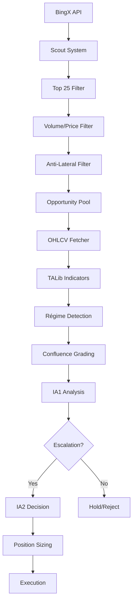

# 🚀 DUAL AI TRADING BOT - ULTRA PROFESSIONAL EDITION

## 📋 TABLE DES MATIÈRES
1. [Vue d'ensemble](#vue-densemble)
2. [Architecture du système](#architecture-du-système)
3. [Logique métier](#logique-métier)
4. [Système IA Dual](#système-ia-dual)
5. [Indicateurs techniques](#indicateurs-techniques)
6. [Configuration et prompts](#configuration-et-prompts)
7. [Flux de données](#flux-de-données)
8. [API et endpoints](#api-et-endpoints)
9. [Guide développeur](#guide-développeur)
10. [Troubleshooting](#troubleshooting)

---

## 🎯 VUE D'ENSEMBLE

### Concept Principal
Trading bot automatisé utilisant **2 IA distinctes** (IA1 + IA2) pour analyser les futures crypto BingX avec système de **régime de marché** et **confluence technique** avancée.

### Flux Principal
```
BingX Market Data → Scout System → IA1 Analysis → IA2 Decision → Execution
```

### Caractéristiques Uniques
- **Dual IA Architecture** : IA1 (analyse) + IA2 (décision)
- **Régime Detection** : 10 régimes de marché avec ML confidence
- **Confluence Grading** : Système de notation A++ à D
- **Dynamic Risk-Reward** : Seuils adaptatifs par type de trade
- **TALib Professional** : Indicateurs techniques précis
- **Top 25 Focus** : Concentration sur cryptos major market cap

---

## 🏗️ ARCHITECTURE DU SYSTÈME

### Structure Modulaire (Nouvelle Architecture v6.0)

```
/app/
├── 📁 config/                          # Configuration externalisée
│   ├── api_keys.json                  # Clés API centralisées
│   ├── trading_config.json            # Paramètres trading
│   └── indicators_config.json         # Config indicateurs
│
├── 📁 prompts/                         # Prompts IA externalisés
│   ├── ia1_v6.json                    # Prompt IA1 complet
│   ├── ia2_v6.json                    # Prompt IA2 complet
│   └── templates/                      # Templates réutilisables
│
├── 📁 core/                           # Modules métier
│   ├── indicators/                     # Système d'indicateurs
│   │   ├── base_indicator.py          # Classe de base
│   │   ├── talib_indicators.py        # Indicateurs TALib
│   │   ├── regime_detector.py         # Détection régime
│   │   └── confluence_calculator.py   # Calcul confluence
│   │
│   ├── ai/                            # Système IA
│   │   ├── prompt_manager.py          # Gestion prompts
│   │   ├── ia1_engine.py              # Moteur IA1
│   │   ├── ia2_engine.py              # Moteur IA2
│   │   └── llm_client.py              # Client LLM unifié
│   │
│   ├── market/                        # Données marché
│   │   ├── bingx_client.py            # Client BingX
│   │   ├── opportunity_scout.py       # Scout opportunités
│   │   └── ohlcv_manager.py           # Gestion données OHLCV
│   │
│   └── analysis/                      # Analyse technique
│       ├── technical_analyzer.py      # Analyseur principal
│       ├── pattern_detector.py        # Détecteur patterns
│       └── risk_calculator.py         # Calcul risque/reward
│
├── 📁 api/                            # API FastAPI
│   ├── main.py                        # Point d'entrée API
│   ├── routes/                        # Routes organisées
│   └── models/                        # Modèles Pydantic
│
├── 📁 backend/                        # Legacy (à migrer)
│   └── server.py                      # Ancien système monolithique
│
└── 📁 frontend/                       # Interface React
    ├── src/                           # Code React
    └── public/                        # Assets statiques
```

### Philosophie Architecturale

1. **Séparation des responsabilités** : Chaque module a une fonction claire
2. **Configuration externe** : Aucun paramètre hardcodé
3. **Prompts modulaires** : IA facilement modifiable sans code
4. **Indicateurs extensibles** : Système ouvert pour nouveaux indicateurs
5. **Tests isolés** : Chaque composant testable individuellement

---

## 💼 LOGIQUE MÉTIER

### 1. Scout System (Découverte d'opportunités)

**Objectif** : Identifier les meilleures opportunités crypto parmi BingX futures

**Processus** :
```
BingX API → Top 25 Market Cap → Filtrage Volume/Prix → Anti-Lateral Detection → Opportunities Pool
```

**Critères de Filtrage** :
- ✅ **Top 25 Market Cap** : Focus sur majors (BTCUSDT, ETHUSDT, LINKUSDT...)
- ✅ **Volume minimum** : >500K pour liquidité
- ✅ **Variation prix** : >2% pour momentum
- ✅ **Anti-lateral** : Exclusion patterns sideways
- ✅ **Données réelles** : Rejection fake/fallback data

### 2. Régime Detection System

**Objectif** : Classifier le régime de marché pour adapter stratégie

**10 Régimes Supportés** :
- `TRENDING_UP_STRONG` : Tendance haussière forte (ADX>25, MACD+, slope+)
- `TRENDING_UP_MODERATE` : Tendance haussière modérée  
- `BREAKOUT_BULLISH` : Breakout haussier (BB squeeze + volume)
- `CONSOLIDATION` : Consolidation/range (ADX<20, RSI neutre)
- `RANGING_TIGHT` : Range serré
- `RANGING_WIDE` : Range large
- `VOLATILE` : Marché volatil (ATR élevé)
- `TRENDING_DOWN_MODERATE` : Tendance baissière modérée
- `TRENDING_DOWN_STRONG` : Tendance baissière forte
- `BREAKOUT_BEARISH` : Breakout baissier

**Algorithme de Détection** :
```python
# Exemple logique régime
if adx > 25 and trend_bullish and macd_positive and slope > 0.003:
    regime = "TRENDING_UP_STRONG"
    confidence = 0.8
elif bb_squeeze and volume_surge and macd_positive:
    regime = "BREAKOUT_BULLISH" 
    confidence = 0.85
```

### 3. Confluence Grading System

**Objectif** : Noter la qualité du setup de 0-100 points avec grades A++ à D

**Critères Obligatoires** (pour éviter grade D) :
- Confidence ML > 65%
- ADX > 18 OU BB Squeeze actif
- Volume ratio > 1.0

**Système de Points** :
- **Base confidence** : 40 points max
- **Conditions momentum** : 5 points chacune (min 2 sur 6)
- **High conviction triggers** : 15-20 points bonus
- **Consistency technique** : 10 points max

**Grades** :
- `A++` : 90-100 points (conviction TRÈS HAUTE)
- `A+` : 80-89 points (conviction TRÈS HAUTE)  
- `A` : 75-79 points (conviction HAUTE)
- `B+` : 70-74 points (conviction HAUTE)
- `B` : 65-69 points (conviction MOYENNE)
- `C` : 50-64 points (conviction FAIBLE - pas de trade)
- `D` : 0-49 points (ÉVITER - critères non remplis)

---

## 🤖 SYSTÈME IA DUAL

### IA1 (Analyse Technique Professionnelle)

**Rôle** : Analyste technique expert utilisant indicateurs TALib et régime detection

**Inputs** :
- Données OHLCV (26-50+ barres optimal)
- Indicateurs TALib calculés (RSI, MACD, ADX, MFI, BB, Stochastic...)
- Régime de marché détecté
- Confluence grade et score

**Process** :
```
Données → TALib Indicators → Régime Analysis → Confluence Grading → IA1 Reasoning → Signal + RR
```

**Outputs** :
```json
{
  "signal": "LONG|SHORT|HOLD",
  "confidence": 0.75,
  "reasoning": "7-step analysis avec régime + confluence",
  "entry_price": 22.1456,
  "stop_loss_price": 20.8500,
  "take_profit_price": 25.2750,
  "calculated_rr": 2.85,
  "trade_type": "intraday",
  "minimum_rr_threshold": 2.0
}
```

**Escalation vers IA2** (3 voies) :
- **VOIE 1** : Signal LONG/SHORT + confidence ≥ 70%
- **VOIE 2** : RR ≥ seuil dynamique (1.5 scalping, 2.0 intraday, 2.5 swing)
- **VOIE 3** : Confidence ≥ 95% (override exceptionnel)

### IA2 (Décision d'Exécution)

**Rôle** : Décideur final avec analyse indépendante et calcul position sizing

**Inputs** :
- Analyse IA1 complète
- Données marché actualisées
- Historique performance
- Contexte risque global

**Process** :
```
IA1 Analysis → Independent Calculation → Risk Assessment → Position Sizing → Final Decision
```

**Outputs** :
```json
{
  "decision": "EXECUTE|HOLD|REJECT",
  "signal": "LONG|SHORT",
  "confidence": 0.82,
  "position_size": 1.2,
  "risk_pct": 1.0,
  "reasoning": "Independent IA2 analysis",
  "execution_price": 22.1500,
  "stop_loss": 20.8400,
  "take_profit": 25.3000
}
```

---

## 📊 INDICATEURS TECHNIQUES

### Système TALib Professional

**Core Indicators** (calculés via TA-Lib) :

1. **RSI (Relative Strength Index)** :
   - Périodes : 9, 14, 21
   - Zones : Oversold (<30), Neutral (30-70), Overbought (>70)

2. **MACD (Moving Average Convergence Divergence)** :
   - Paramètres : Fast=12, Slow=26, Signal=9
   - Composants : Line, Signal, Histogram
   - Tendance : Bullish/Bearish/Neutral

3. **ADX (Average Directional Index)** :
   - Méthode Wilder correcte
   - Force : Weak (<20), Moderate (20-25), Strong (25-50), Very Strong (>50)
   - Composants : ADX, +DI, -DI, DX

4. **Bollinger Bands** :
   - Période : 20, Std Dev : 2
   - Position : 0-100% dans les bandes
   - Squeeze Detection : Bandwidth < 2% = squeeze

5. **Stochastic** :
   - %K period : 14, %D period : 3
   - Overbought : >80, Oversold : <20

6. **MFI (Money Flow Index)** :
   - Période : 14
   - Institutional activity : Distribution (>80), Accumulation (<20)

7. **ATR (Average True Range)** :
   - Période : 14
   - Volatility measurement en % du prix

8. **VWAP (Volume Weighted Average Price)** :
   - Distance en % du prix actuel
   - Support/Resistance dynamique

### Configuration Indicateurs

Voir `/app/config/trading_config.json` pour tous les paramètres modifiables :

```json
{
  "indicators": {
    "rsi": {
      "periods": [9, 14, 21],
      "overbought": 70,
      "oversold": 30
    },
    "macd": {
      "fast_period": 12,
      "slow_period": 26,
      "signal_period": 9
    }
  }
}
```

---

## ⚙️ CONFIGURATION ET PROMPTS

### Configuration Système

**API Keys** (`/app/config/api_keys.json`) :
```json
{
  "bingx": {
    "api_key": "your_bingx_key",
    "secret_key": "your_secret"
  },
  "coinmarketcap": {
    "api_key": "your_cmc_key"
  }
}
```

**Trading Config** (`/app/config/trading_config.json`) :
- Paramètres scout (top 25, seuils volume/prix)
- Critères escalation IA1→IA2
- Configuration indicateurs techniques
- Régimes et confluence

### Prompts Externalisés

**IA1 Prompt** (`/app/prompts/ia1_v6.json`) :
- Structure JSON complète avec sections modulaires
- Variables TALib intégrées
- 7-step reasoning framework
- Validation automatique des variables

**Utilisation** :
```python
from core.ai.prompt_manager import get_prompt_manager

pm = get_prompt_manager()
formatted_prompt = pm.format_prompt("ia1_v6", {
    "symbol": "BTCUSDT",
    "regime": "TRENDING_UP_STRONG", 
    "confidence": 0.78,
    # ... autres variables
})
```

**Avantages** :
- ✅ Modification prompts sans redéploiement
- ✅ Validation automatique variables
- ✅ Versioning et rollback faciles
- ✅ Testing prompts isolément

---

## 🔄 FLUX DE DONNÉES

### Pipeline Principal



### Gestion des Données

**OHLCV Requirements** :
- **Minimum** : 26 barres (pour MACD)
- **Optimal** : 50+ barres (pour tous indicateurs)
- **Timeframe** : 1H par défaut
- **Sources** : BingX (primary), CoinMarketCap, TwelveData (backup)

**Column Mapping Auto** :
```python
# Le système détecte automatiquement
{
    'high': 'High' ou 'high' ou colonne[1],
    'low': 'Low' ou 'low' ou colonne[2], 
    'close': 'Close' ou 'close' ou colonne[3],
    'volume': 'Volume' ou 'volume' ou colonne[4]
}
```

**Cache Management** :
- Trending cryptos : Cache 4h
- OHLCV data : Cache 1h  
- Indicators : Recalcul à chaque analyse
- Régimes : Historique 50 derniers

---

## 🌐 API ET ENDPOINTS

### Endpoints Principaux

**Opportunities** :
```
GET /api/opportunities
Response: {
  "success": true,
  "count": 8,
  "opportunities": [...],
  "filter_status": "scout_filtered_only"
}
```

**IA1 Analysis** :
```
POST /api/force-ia1-analysis
Body: {"symbol": "BTCUSDT"}
Response: {
  "success": true,
  "analysis": {...},
  "escalated": true
}
```

**IA2 Decisions** :
```  
GET /api/trading-decisions
Response: {
  "success": true,
  "decisions": [...],
  "active_positions": 3
}
```

**Scout Management** :
```
POST /api/trending-force-update
Response: {
  "updated": true,
  "count": 25,
  "symbols": [...]
}
```

### Modèles de Données

**Opportunity** :
```python
class MarketOpportunity(BaseModel):
    symbol: str
    current_price: float
    volume_24h: float
    price_change_24h: float
    data_sources: List[str]
    volatility: Optional[float]
```

**Technical Analysis** :
```python  
class TechnicalAnalysis(BaseModel):
    symbol: str
    rsi: float
    macd_histogram: float
    confluence_grade: str
    regime: str
    # ... autres indicateurs
```

---

## 👨‍💻 GUIDE DÉVELOPPEUR

### Setup Environnement

1. **Installation** :
```bash
cd /app
pip install -r requirements.txt
yarn install  # pour frontend
```

2. **Configuration** :
```bash
# Copier et modifier les configs
cp config/api_keys.json.example config/api_keys.json
# Ajouter vos vraies clés API
```

3. **Services** :
```bash
# Démarrer backend
sudo supervisorctl restart backend

# Démarrer frontend  
sudo supervisorctl restart frontend

# Démarrer tous
sudo supervisorctl restart all
```

### Développement Modulaire

**Ajouter un Nouvel Indicateur** :
```python
# 1. Créer dans core/indicators/
class MyCustomIndicator(BaseIndicator):
    def calculate(self, data: pd.DataFrame) -> IndicatorResult:
        # Votre logique
        return IndicatorResult(value=result, signal="BULLISH")

# 2. Intégrer dans TALibIndicators
# 3. Ajouter aux prompts si nécessaire
# 4. Tester isolément
```

**Modifier un Prompt** :
```json
// 1. Éditer /app/prompts/ia1_v6.json
{
  "main_prompt": {
    "reasoning": "Nouvelle logique de reasoning..."
  }
}

// 2. Redémarrer prompt manager (ou reload)
// 3. Tester avec nouvelles variables
```

**Ajouter un Nouveau Régime** :
```python
# 1. Ajouter dans config/trading_config.json
{
  "regime_detection": {
    "regimes": [..., "NEW_REGIME"]
  }
}

# 2. Implémenter détection dans regime_detector.py  
# 3. Ajouter aux prompts
# 4. Tester avec données historiques
```

### Tests et Validation

**Test Indicateurs** :
```python
# Test isolé d'un indicateur
python scripts/test_indicators.py --indicator RSI --symbol BTCUSDT

# Test système complet
python -m pytest tests/test_indicators.py
```

**Test Prompts** :
```python  
# Test formatage prompt
from core.ai.prompt_manager import get_prompt_manager
pm = get_prompt_manager()
result = pm.format_prompt("ia1_v6", test_variables)
```

**Debug Mode** :
```python
# Activer logs détaillés
import logging
logging.basicConfig(level=logging.DEBUG)

# Test avec données réelles
curl -X POST /api/force-ia1-analysis -d '{"symbol":"BTCUSDT"}'
```

---

## 🔧 TROUBLESHOOTING

### Problèmes Fréquents

**1. "no_scout_data" dans opportunities** :
```bash
# Vérifier BingX API
curl "https://open-api.bingx.com/openApi/swap/v2/quote/ticker"

# Forcer update manuel  
curl -X POST /api/trending-force-update

# Vérifier clés API
cat config/api_keys.json
```

**2. Indicateurs à 0.0 ou None** :
```bash
# Vérifier données OHLCV
tail -f /var/log/supervisor/backend.*.log | grep "DataFrame columns"

# Tester indicateurs isolément  
python scripts/test_indicators.py --debug
```

**3. Erreurs de formatage prompt** :
```bash
# Vérifier variables disponibles
grep "Missing variable" /var/log/supervisor/backend.*.log

# Valider prompt JSON
python -c "import json; print(json.load(open('prompts/ia1_v6.json')))"
```

**4. IA1/IA2 ne répond pas** :
```bash  
# Vérifier LLM key
curl emergency_integrations_manager

# Tester prompt direct
python core/ai/test_llm_direct.py
```

### Commandes Utiles

**Monitoring** :
```bash
# Logs backend temps réel
tail -f /var/log/supervisor/backend.*.log

# Status services
sudo supervisorctl status

# Usage CPU/RAM
htop
```

**Database** :
```bash
# MongoDB status
sudo systemctl status mongodb

# Collections
mongo myapp --eval "db.analyses.find().limit(5)"
```

**Cache Management** :
```bash
# Vider cache Redis si utilisé
redis-cli FLUSHALL

# Restart propre
sudo supervisorctl restart all
```

### Logs Importants

**Recherche d'erreurs** :
```bash
# Erreurs critiques
grep -i "error\|critical\|failed" /var/log/supervisor/backend.*.log

# Performance
grep -i "slow\|timeout\|cpu" /var/log/supervisor/backend.*.log  

# IA responses
grep -i "ia1\|ia2\|gpt\|claude" /var/log/supervisor/backend.*.log
```

---

## 📈 PERFORMANCE ET MÉTRIQUES

### KPIs Système

- **Scout Success Rate** : % opportunités trouvées vs total BingX
- **IA1 Escalation Rate** : % analyses escaladées vers IA2
- **IA2 Execution Rate** : % décisions EXECUTE vs HOLD/REJECT
- **RR Accuracy** : Précision calculs Risk-Reward
- **Confluence Distribution** : Répartition grades A++ à D

### Optimisations

**CPU** :
- Cache intelligent OHLCV 
- Calcul indicateurs parallèles
- Batch processing opportunités

**Memory** :
- Limitation cache size
- Garbage collection régulière
- Streaming données volumineuses

**Network** :
- Rate limiting APIs externes
- Retry exponential backoff
- Connection pooling

---

## 🔮 ROADMAP ET ÉVOLUTIONS

### Fonctionnalités en Développement

1. **Multi-Timeframe Analysis** : 1H + 4H + 1D confluence
2. **Portfolio Management** : Gestion multi-positions  
3. **Backtest Engine** : Test stratégies historiques
4. **Risk Management** : Stop-loss dynamiques
5. **Performance Analytics** : Dashboard métrics avancé

### Architecture Future

- **Microservices** : Split en services indépendants
- **Event Streaming** : Kafka/Redis pour temps réel  
- **ML Pipeline** : Training modèles régime custom
- **Multi-Exchange** : Binance, OKX, Bybit support
- **Mobile App** : Interface mobile native

---

## 📞 SUPPORT ET CONTACT

### Pour Agents IA / Développeurs

Ce README doit suffire à comprendre l'architecture et travailler efficacement sur le système. 

**Workflow Recommandé** :
1. Lire cette documentation complètement
2. Explorer structure `/app/core/` et `/app/config/`
3. Tester modules isolément avant modifications
4. Utiliser logs détaillés pour debug
5. Valider sur petits échantillons avant déploiement

**Bonnes Pratiques** :
- ✅ Toujours tester indicateurs avec données réelles
- ✅ Valider prompts avant modification
- ✅ Backup configs avant changements
- ✅ Utiliser branches Git pour fonctionnalités
- ✅ Documenter nouveaux modules

---

*Documentation générée pour Dual AI Trading Bot v6.0 - Architecture Modulaire Professionnelle*
